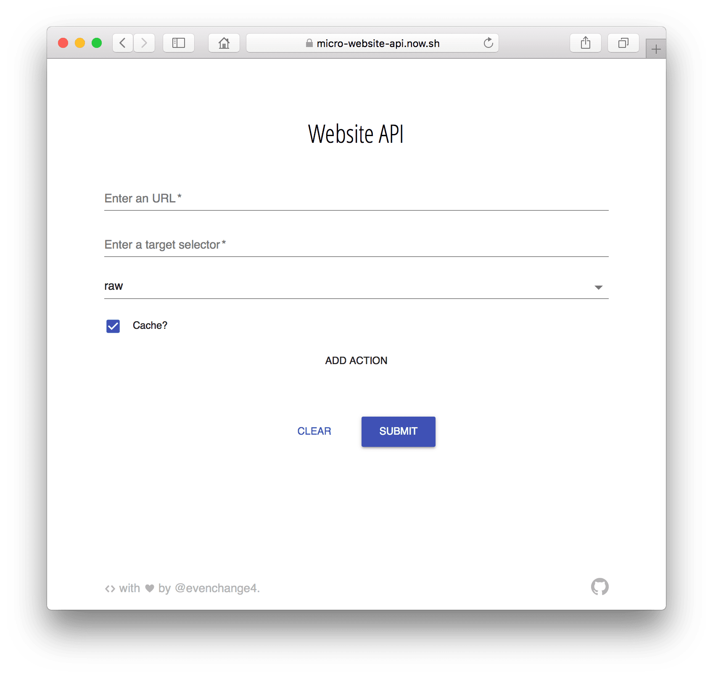

# Micro-website-api

> A api microservice that crawl dynamic website power by
> [puppeteer](https://github.com/GoogleChrome/puppeteer).

[![Travis][travis-badge]][travis] [![Codecov Status][codecov-badge]][codecov]
[![Dependency Status][dependency-badge]][dependency]
[![devDependency Status][devdependency-badge]][devdependency]
[![peerDependency Status][peerdependency-badge]][peerdependency]
[![Greenkeeper badge][greenkeeper-badge]][greenkeeper]
[![prettier][prettier-badge]][prettier] [![license][license-badge]][license]

[](https://micro-website-api.now.sh)

## How To Use

### a. Deploy to Now.sh

> One click deploys to △ now

[](https://deploy.now.sh/?repo=https://github.com/evenchange4/micro-website-api&env=TIMEOUT&env=REACT_APP_GA_ID&docker=true)

### b. Docker image

```
$ docker build -t micro-website-api .
$ docker run --rm -it \
  -p 3000:3000 \
  -e "TIMEOUT=300000" \
  -e "REACT_APP_GA_ID=''" \
  micro-website-api
```

## API

### Environment variables

| **ENV**           | **Required** | **Default** | **Description**   |
| ----------------- | ------------ | ----------- | ----------------- |
| `TIMEOUT`         | V            |             | Wait for timeout. |
| `REACT_APP_GA_ID` |              | ''          | For GA.           |

## Demo

> Note: You should deploy your own service for production usage.

1. Prerender a SPA.
   [\[WebUI\]](https://micro-website-api.now.sh/?cache=true&format=raw&selector=body&url=https%3A%2F%2Fmichaelhsu.tw)
   [\[API\]](https://micro-website-api.now.sh/api?cache=true&format=raw&selector=body&url=https%3A%2F%2Fmichaelhsu.tw)

2. With target `selector`.
   [\[WebUI\]](https://micro-website-api.now.sh/?cache=true&format=raw&selector=%23ctl00_PlaceHolderEmptyMain_PlaceHolderMain_fecurrentid_gvResult&url=http%3A%2F%2Fwww.tcb-bank.com.tw%2Ffinance_info%2FPages%2Fforeign_spot_rate.aspx)
   [\[API\]](https://micro-website-api.now.sh/api?cache=true&format=raw&selector=%23ctl00_PlaceHolderEmptyMain_PlaceHolderMain_fecurrentid_gvResult&url=http%3A%2F%2Fwww.tcb-bank.com.tw%2Ffinance_info%2FPages%2Fforeign_spot_rate.aspx)

3. `Click` to send an ajax and wait for a `selector`.
   [\[WebUI\]](<https://micro-website-api.now.sh/?actions=%23formLink%20%3E%20div%3Anth-child(3)%20%3E%20div.wsize_onepage%20%3E%20ul.exchange_intab%20%3E%20li%3Anth-child(2)%20a,%23formLink%20%3E%20div%3Anth-child(3)%20%3E%20div.wsize_onepage%20%3E%20ul.exchange_intab%20%3E%20li%3Anth-child(2).active&cache=true&format=raw&selector=table&url=https%3A%2F%2Fibank.bok.com.tw%2FPIB%2Fca%2Fca02101%2FCA02101_HOME.xhtml>)
   [\[API\]](<https://micro-website-api.now.sh/api?actions=%23formLink%20%3E%20div%3Anth-child(3)%20%3E%20div.wsize_onepage%20%3E%20ul.exchange_intab%20%3E%20li%3Anth-child(2)%20a,%23formLink%20%3E%20div%3Anth-child(3)%20%3E%20div.wsize_onepage%20%3E%20ul.exchange_intab%20%3E%20li%3Anth-child(2).active&cache=true&format=raw&selector=table&url=https%3A%2F%2Fibank.bok.com.tw%2FPIB%2Fca%2Fca02101%2FCA02101_HOME.xhtml>)

4. `Click` to send an ajax and wait for a long `timeout`.
   [\[WebUI\]](<https://micro-website-api.now.sh/?actions=%23noticeall%20%3E%20div.noticeright%20%3E%20div%20%3E%20div.index_icon01%20%3E%20div.itemright%20%3E%20ul%20%3E%20li%3Anth-child(3)%20%3E%20a,15000&cache=true&format=raw&selector=%23css_table1&url=https%3A%2F%2Fipost.post.gov.tw%2Fpst%2Fhome.html>)
   [\[API\]](<https://micro-website-api.now.sh/api?actions=%23noticeall%20%3E%20div.noticeright%20%3E%20div%20%3E%20div.index_icon01%20%3E%20div.itemright%20%3E%20ul%20%3E%20li%3Anth-child(3)%20%3E%20a,15000&cache=true&format=raw&selector=%23css_table1&url=https%3A%2F%2Fipost.post.gov.tw%2Fpst%2Fhome.html>)

5. Response `JSON` format.
   [\[WebUI\]](https://micro-website-api.now.sh/?cache=true&format=json&selector=%23root%20%3E%20div&url=https%3A%2F%2Fmichaelhsu.tw%2F)
   [\[API\]](https://micro-website-api.now.sh/api?cache=true&format=json&selector=%23root%20%3E%20div&url=https%3A%2F%2Fmichaelhsu.tw%2F)

## Developer Guide

### Requirements

* node >= 9.1.0
* npm >= 5.5.1
* yarn >= 1.3.2

```
$ git clone https://github.com/evenchange4/micro-website-api.git
$ yarn install --pure-lockfile
$ yarn run dev # dev server
$ yarn start   # prod server
```

### Test

```
$ yarn run format
$ yarn run eslint
$ yarn run test:watch
$ yarn run flow
```

## Inspiration

* https://wrapapi.com/
* https://github.com/ebidel/try-puppeteer

## CONTRIBUTING

* ⇄ Pull requests and ★ Stars are always welcome.
* For bugs and feature requests, please create an issue.
* Pull requests must be accompanied by passing automated tests (`$ yarn run
  test`).

## [CHANGELOG](CHANGELOG.md)

## [LICENSE](LICENSE)

MIT: [http://michaelhsu.mit-license.org](http://michaelhsu.mit-license.org)

[travis-badge]: https://img.shields.io/travis/evenchange4/micro-website-api/master.svg?style=flat-square
[travis]: https://travis-ci.org/evenchange4/micro-website-api
[codecov-badge]: https://img.shields.io/codecov/c/github/evenchange4/micro-website-api.svg?style=flat-square
[codecov]: https://codecov.io/github/evenchange4/micro-website-api?branch=master
[dependency-badge]: https://david-dm.org/evenchange4/micro-website-api.svg?style=flat-square
[dependency]: https://david-dm.org/evenchange4/micro-website-api
[devdependency-badge]: https://david-dm.org/evenchange4/micro-website-api/dev-status.svg?style=flat-square
[devdependency]: https://david-dm.org/evenchange4/micro-website-api#info=devDependencies
[peerdependency-badge]: https://david-dm.org/evenchange4/micro-website-api/peer-status.svg?style=flat-square
[peerdependency]: https://david-dm.org/evenchange4/micro-website-api#info=peerDependencies
[license-badge]: https://img.shields.io/github/license/evenchange4/micro-website-api.svg?style=flat-square
[license]: http://michaelhsu.mit-license.org/
[greenkeeper-badge]: https://badges.greenkeeper.io/evenchange4/micro-website-api.svg
[greenkeeper]: https://greenkeeper.io/
[prettier-badge]: https://img.shields.io/badge/styled_with-prettier-ff69b4.svg?style=flat-square
[prettier]: https://github.com/prettier/prettier
